# Abstract
Intrusion detection technology is a proactive way to monitor attacks in the network. As the amount of data which is received by the network goes beyond the memory constraints of standard monitoring applications using Data Streaming algorithm seems like good strategy Pham et al. (2014). In this project we stimulated the network traffic and implemented Data Streaming algorithm Micro Cluster Nearest Neighbor (MC -NN) to classify the network packets as normal or anomaly. We also implemented the KNN (offline) to compare the performance of MC-NN. In the data preparation part, we used outlier detector method “IQR” to eliminate the outliers. We compared and analyzed the results of these two algorithms. 

# I. Introduction


## Context

As the number of devices which are connected to network increases it leads to openness, diversity and sharing of knowledge but it also has the scope for many security risks. As the types of attacks are becoming complex we need to find creative ways to enhance intrusion detection systems Keegan et al. (2016). One of the major hurdles of large-scale network intrusion detection is the processing and analyzing vast amount of heterogeneous data. Many Machine learning algorithms have been applied to this problem but they treat this problem as offline problem where they train the model once and then deploy to incoming traffic M. Ahmed et al (2016) 
## Presentation of the Problem
The problem we are considering in this project is how to make detect anomaly online (i.e without training the model offline) when dealing with large amount of data. As the problem is classification we looked at K- Nearest Neighbor (KNN) . The major issue with KNN is that it doesn’t scale well for large data so we looked at the scalable version of KNN i.e. Micro-Cluster Nearest Neighbor (MC-NN) 
## Objectives

The main objective of our project is to implement Micro-Cluster Nearest Neighbour (MC-NN) data stream classifier . We use the traditional KNN as the baseline to evaluate the performance of  MC-NN.

## Related Work

There is a large body of literature that deal with Anomaly detection. We restricted our research to application of Machine Learning techniques to Network detection problem. The most commonly used Machine learning techniques are Neural Network, clustering based and rule-based V. Chandola, (2009). In Data Streaming domain Giannella et al proposed FP- Stream based on FP- Tree algorithm. Oh et al proposed clustering on data streams in 2005. Recently Carela-Español proposed Hoeffding Adaptive Trees to evaluate data stream classification. 
# II. Materials and Methods

## Dataset

### 1. Background
The dataset consists of a variety of network intrusion simulated data in a 
military network environment. It contains 25192 rows of TCP/IP connection 
data. Each connection is a TCP packet which contains 42 columns. There is no 
NULL or EMPTY values in original dataset, while it does have outliers which we 
will eliminate during data preprocessing step.

### 2. Dataset analysis
In the original dataset, feature types are described as below:

<table>
    <thead>
        <tr>
          <th> Data type </th>
          <th> Number </th>
          <th> Columns </th>
        </tr>
    </thead>
    <tbody>
        <tr>
            <td> qualitative (string) </td>
            <td> 4 </td>
            <td> protocol, service, flag, target </td>
        </tr>
        <tr>
            <td> quantitative (int/float) </td>
            <td> 38 </td>
            <td> duration, land, urgent, etc... </td>
        </tr>
    </tbody>
</table>

#### (1) Class labels:

<table>
    <thead>
        <tr>
          <th> </th>
          <th colspan=2> Original dataset </th>
          <th colspan=2> Preprocessed dataset </th>
        </tr>
        <tr>
            <th> </th>
            <th> Target </th>
            <th> Rows </th>
            <th> Target </th>
            <th> Rows </th>
        </tr>
    </thead>
    <tbody>
        <tr>
            <td> Positive Class </td>
            <td> Anomaly </td>
            <td> 11743 </td>
            <td> Anomaly </td>
            <td> 11708 </td>
        </tr>
        <tr>
            <td> Negative Class </td>
            <td> Normal </td>
            <td> 13449 </td>
            <td> Normal </td>
            <td> 13404 </td>
        </tr>
        <tr>
            <td> Total </td>
            <td> </td>
            <td> 25912 </td>
            <td> </td>
            <td> 25112 </td>
        </tr>
    </tbody>
</table>

#### (2) Correlations:

We analyzed the original dataset and the preprocessed dataset and 
plot their correlations between features. Here is the result.

|     Original dataset          | Preprocessed dataset          |
| ----------------------------- | ----------------------------- |
|  | 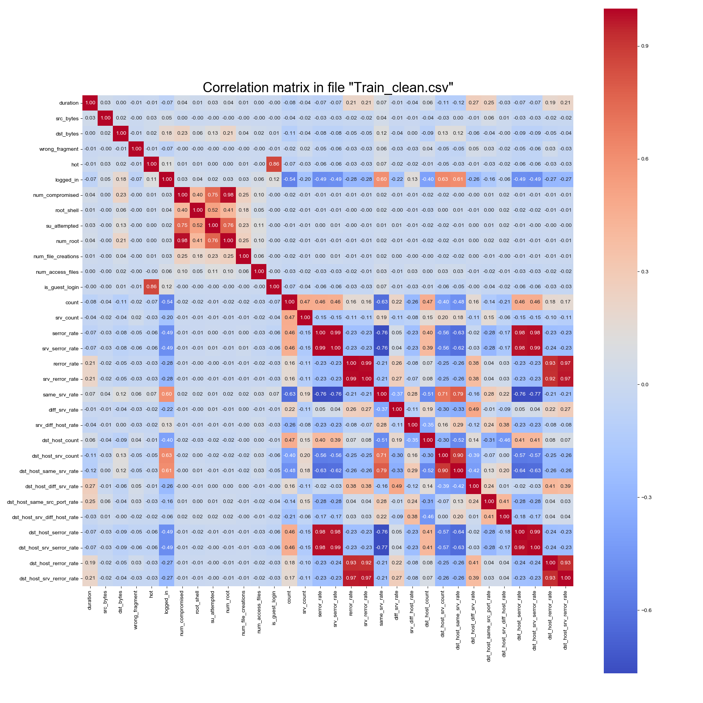 |

<i>(the plots were generated by the code in [dataset_analysis.py](./dataset_analysis.py), references 
are mentioned inside the file. The result also ensures that preprocessing step does not change the 
correlations much.) </i>

### 3. Data preprocessing
#### (1) Outlier detection and filtering:
We used an outlier detection method which is called “IQR method” developed by 
John Tukey only on the 38 quantitative type columns. The IQR method and a result 
is briefly described below.

* IQR method introduction:

IQR indicates interquartile range. It is a measure of the dispersion similar 
to 2 different quantiles of the data. Tukey who developed this method considered
any data point that falls either <i>below 1.5 times the IQR of the first 
quartile</i> or <i>above 1.5 times the IQR of the third quartile</i> to be “outliers”. 

During our preprocessing step, we consider data where <i>1.5 times its IQR score 
is below the  
quantile</i> or <i>1.5 times its IQR score is above 
 quantile</i> 
to be outliers, because outliers in our original dataset is not numerous.

(reference: http://colingorrie.github.io/outlier-detection.html) <br/>
(reference: https://www.khanacademy.org/math/statistics-probability/summarizing-quantitative-data/box-whisker-plots/a/identifying-outliers-iqr-rule)

* Result:

We take an example as a result shown below, where the horizontal feature 
indicates “src_bytes” meaning how many bytes does the source sends, and the 
vertical feature indicates “dst_bytes” meaning how many bytes does the 
destination receives.

|       before outlier filtering      |        after outlier filtering       |
| ----------------------------------- | ------------------------------------ |
| 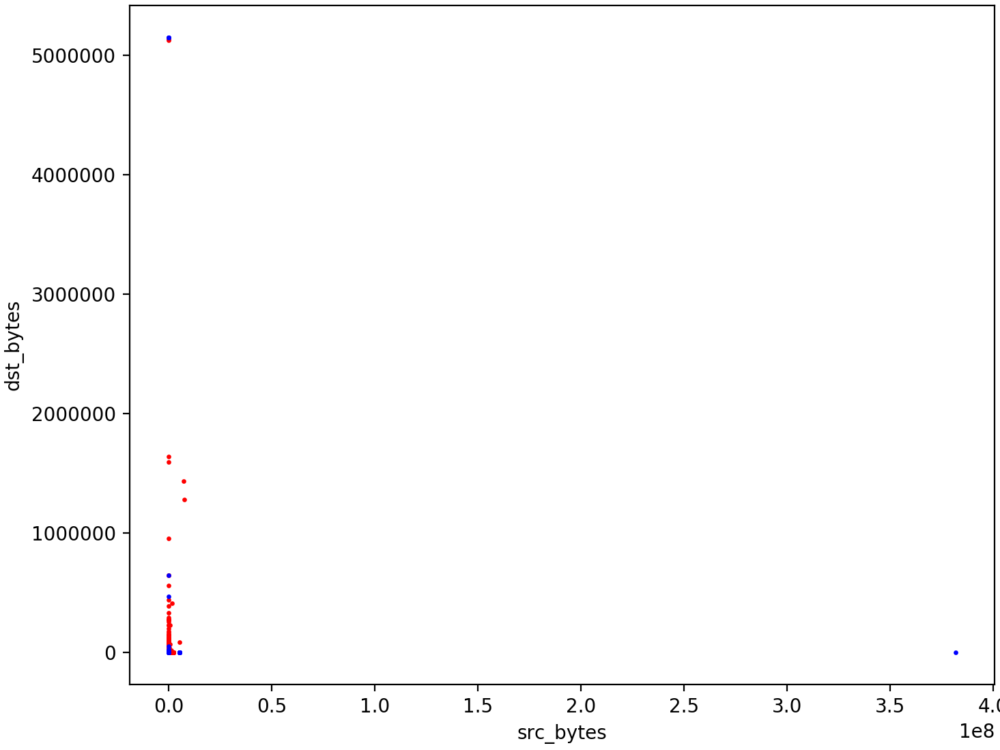 | 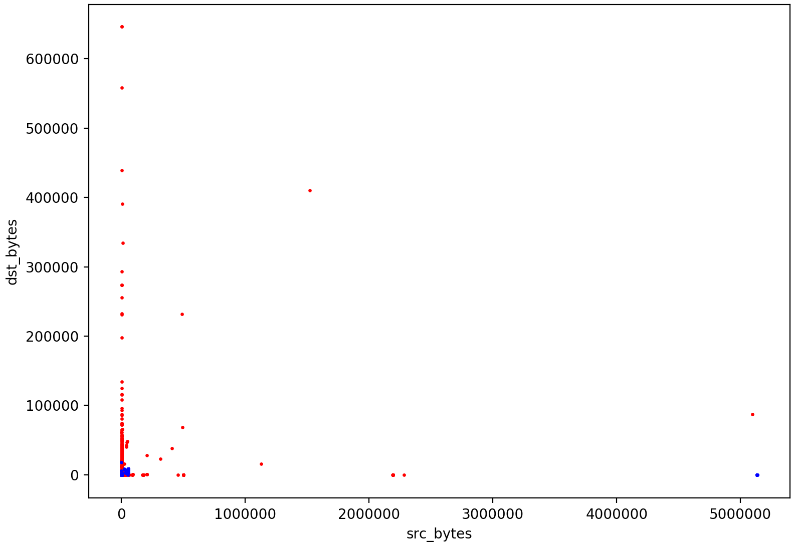 |

* Advantages of outlier filtering:

During our experiments, outlier detection helps MC-NN model a lot. Before filtering, 
the MC-NN model (theta=2, mx=25) performed 82.959% on F1-score, while after 
filtering, the best model (same theta and mx) performed 89.272% on F1-score.

The behind reason we analyzed is: outlier detection and filtering avoid the model 
to split a parent micro cluster to accommodate extrema in the dataset. 
So micro clusters only split when necessary, which increases the overall accuracy.

#### (2) Feature normalization:
We transformed values on the 38 quantitative columns to the range between 0 and 1, 
so that the model won’t be biased towards any feature.

We show a result below on the feature “duration”.

|         before normalizing          |           after normalizing          |
| ----------------------------------- | ------------------------------------ |
| 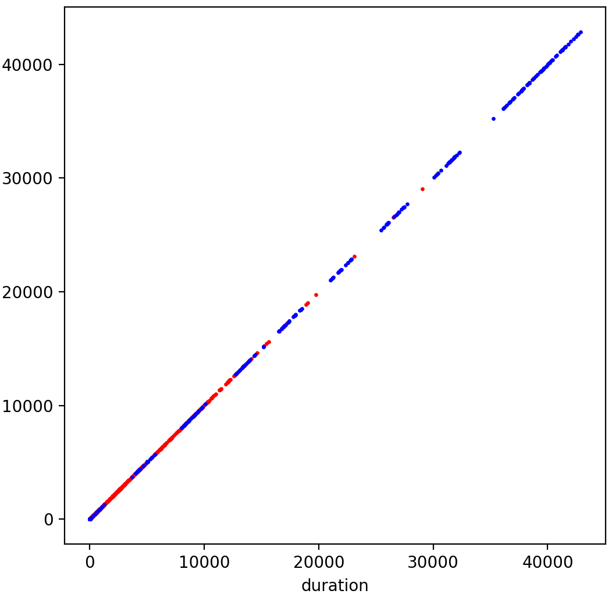  | 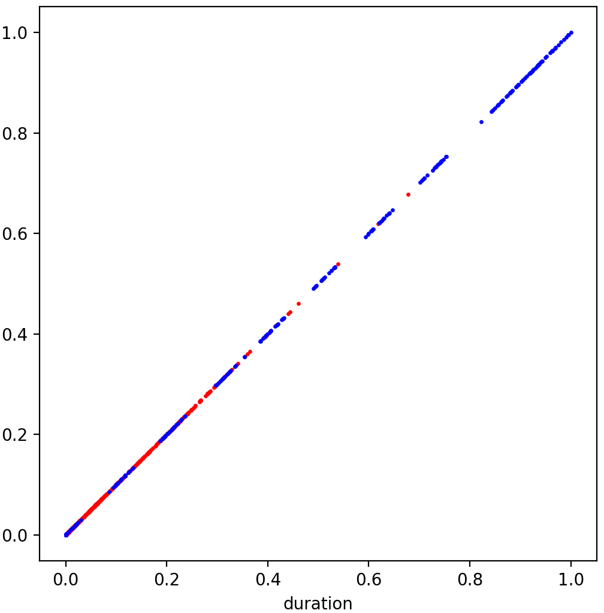 |


### 4. Dataset Source
https://www.kaggle.com/sampadab17/network-intrusion-detection


## Technologies and Algorithms

Spark was used to implement kNN and MC-NN algorithms and simulate streaming 
data in this project.

### 1.  k Nearest Neighbours (kNN)

kNN is a supervised machine learning model used for classification and 
regression. It is widely used in data analytics. kNN algorithm hinges on the 
assumption that similar samples locate in close proximity in the feature space. 
The model picks the k nearest samples in the feature space then predicts the 
new samples based on the majority vote of those k samples.

Here’s the pseudo-code of kNN algorithm:

```
for each testing instance
  Find the k nearest instances from the training set according to a distance metric
  Result class = most frequent class label of the k nearest instances
```

(reference: https://towardsdatascience.com/machine-learning-basics-with-the-k-nearest-neighbors-algorithm-6a6e71d01761) 

(reference: Lecture_slides: Supervised Classification)

In order to provide the baseline for MC-NN performance comparison, kNN was 
applied to the entire dataset offline. Since there is one hyperparameter k 
(the number of nearest neighbours) in kNN, cross-validation was used to search 
for the optimized value of k. The whole dataset was randomly split into 5 folds. 
1/5 was used as training, which is around 5,000 data samples, 4/5 were used 
for test. 

The range of k been search is [3, 9] with the increment of 1, [10, 100] with 
the increment of 10. 

As for the distance calculation, squared difference was used for numerical 
features. Categorical feature distance was considered as 1 for different 
category values. 

kNN is very expensive to compute, since it has to calculate the distance 
between one testing instance with every training sample (there are more than 5,000 
samples in this case). It is infeasible to run the spark job with single node. 
But thanks to Dr. Tristan Glatard’s sponsorship, we were able to perform the 
kNN evaluation on [Compute Canada](https://www.computecanada.ca/)'s cluster within a reasonable running time.

### 2. Micro-Cluster Nearest Neighbour (MC-NN)

(1). Micro Clusters Nearest Neighbour (MC-NN) is a data stream classifier. Data stream by its definition may contain infinite data instances so that MC-NN is applied to the data stream classification for the sake of its fast calculation and update on information.  

The major idea of MC-NN is to calculate the Euclidean distance between a new data instance to each micro-cluster centroid, then assign the instance to the nearest micro-cluster. If it is correctly classified, then add the instance to the micro-cluster. If misclassified, then first add the instance to the correct micro-cluster, and then increment the error counters both on the nearest micro-cluster and the correct micro-cluster, once one of the micro-clusters’ error counter exceed a predefined threshold, we split the micro-cluster into 2.

Here’s the pseudo-code of MC-NN classifier:

```
foreach Micro-Cluster in LocalSet do:
  Evalate Micro-Cluster against NewInstance;
end
Sort EvaluationDistances();
if Nearest Micro-Cluster is of the Training Items Class Label then:
   CorrectClassification Event:
   NewInstance is added into Nearest Micro-Cluster
   Nearest Micro-Cluster Error count(ϵ) reduced
else
   MisClassification Event:
   Two Micro-Clusters Identified:
   1) MC that should have been identified as the Nearest to the New Instance of the
      Classification Label.
   2) MC that incorrectly was the Nearest the New Instance.
      Training item added to the MC of the Correct Classification Label. Both identified
      Micro-Cluster have internal Error count(ϵ) incremented
   foreach Micro-Cluster Identified do:
           if MC's Error count(ϵ) exceeds Error Threshold(θ) then:
              Sub-Divide Micro-Cluster upon attribute of lagest Variance
           end
   end
end
```

(2). Implementation details: In order to adapt to the pyspark.streaming library, a Micro-Cluster is saved as a file with some important information, the following table is the summary of the information.

| row number| Content to save | Initial value |
| :---: | :------: | :-------: |
| 1 | epsilon (ϵ) | 0 |
| 2 | Instances counts |  1  |
| 3 | Centroid |  First random feature  | 
| 4 | CF_2x  | 0.0 |
| 5 | Cluster status  | 'activate'  |
| 6 | File name  | 'normal_mc_1.csv' |

The initial centroids is a random data instance with label 'normal' or 'anomaly'. Each time when a new data instance coming with stream batch, epsilon (ϵ), instance counts, Centroid, and CF_2x will be updated respectively, CF_2x is used for the use of split. As long as the epsilon (ϵ) exceeds the threshold(θ), the relative cluster files will be deactivated, and two children cluster spawn and will be used for the future classification.

The predication labels will be saved in other files for the future evaluation. 

# III. Results

## 1. kNN

For each k, the averaged accuracy, precision, recall and F1-score were calculated 
from 5 iterations, and plotted as below:

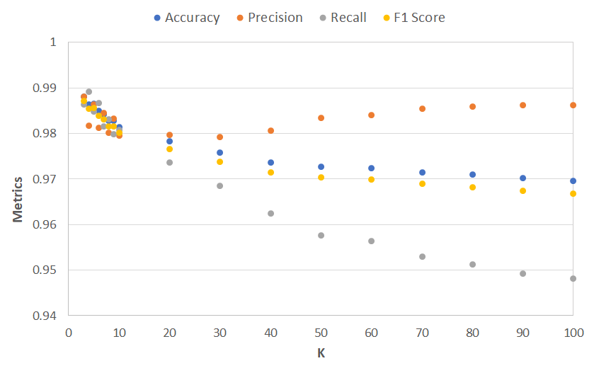

In general, kNN obtained very good results on the dataset, all metrics are 
above 0.94. However, it runs very slowly. The running time for one iteration 
was around 6 minutes even using 32 CPU cores. 

As shown in the plot, accuracy, recall and F1-score all decrease as k increases. 
However, precision first shows a fluctuant decrease and then bounces back when k=10. 
The best overall performance appears when K=3, where the accuracy, precision and 
F1-score are the highest and recall is the third highest. A detailed results 
table is shown as below:

| k    | Accuracy | Precision | Recall  | F1-score |
| ---- | :------: | :-------: | :-----: | :------: |
| 3    | 0.98809  |  0.98811  | 0.98634 | 0.98722  |
| 4    | 0.98639  |  0.98178  | 0.98917 | 0.98546  |
| 5    | 0.98652  |  0.98632  | 0.98475 | 0.98553  |
| 6    | 0.98498  |  0.98118  | 0.98672 | 0.98393  |
| 7    | 0.98425  |  0.98457  | 0.98161 | 0.98308  |
| 8    | 0.98285  |  0.98019  | 0.98310 | 0.98164  |
| 9    | 0.98287  |  0.98331  | 0.97990 | 0.98160  |
| 10   | 0.98144  |  0.97951  | 0.98071 | 0.98010  |
| 20   | 0.97828  |  0.97972  | 0.97358 | 0.97663  |
| 30   | 0.97576  |  0.97930  | 0.96849 | 0.97386  |
| 40   | 0.97368  |  0.98071  | 0.96252 | 0.97150  |
| 50   | 0.97277  |  0.98350  | 0.95769 | 0.97041  |
| 60   | 0.97240  |  0.98400  | 0.95640 | 0.96998  |
| 70   | 0.97151  |  0.98551  | 0.95290 | 0.96893  |
| 80   | 0.97093  |  0.98593  | 0.95123 | 0.96827  |
| 90   | 0.97016  |  0.98618  | 0.94930 | 0.96739  |
| 100  | 0.96967  |  0.98625  | 0.94817 | 0.96683  |

## 2. MC-NN

Unlike the traditional KNN, to evaluate the streaming learning algorithm, we use prequential error. It is the cumulative errors the classifier made over time. The formula is the following S stands for the prequential error.

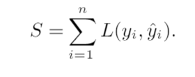

(reference: https://www.researchgate.net/publication/221653555_Issues_in_evaluation_of_stream_learning_algorithms)

In our classification case, the counts of mis-classification is recorded and we plot the mean of that error counts as our prequential error diagram. The following two graphs show in two cases threshold(θ) = 2 and threshold(θ) = 10 with different data amounts concentration.
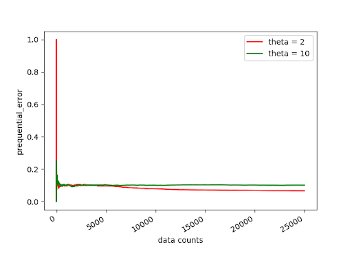
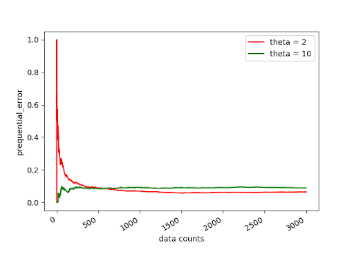

As the graphs show, in both cases, the prequential error start at a high level, it is mainly because, the clusters has very few data instances that may lead to high mis-classification. Gradually, the graph starts to decrease and then tend to maintain stable at certain percentage. It is because the number of total clusters are become unchanged at some time thus the graph of ration error become flat.
# IV. Discussion

## Comparison of Results

The best results of kNN and MC-NN are listed as below:

|           | kNN (k = 3) | MC-NN (theta = 2) |
| --------- | :---------: | :---------------: |
| Accuracy  |   0.98809   |      0.89131      |
| Precision |   0.98811   |      0.82569      |
| Recall    |   0.98634   |      0.97161      |
| F1-score  |   0.98722   |      0.89272      |

Overall, kNN outperforms MC-NN on this dataset. We think the main reason is that kNN has the full picture of the entire dataset (more than 5,000 randomly sampled training samples) since the beginning of classification, while MC-NN only gradually accumulates such knowledge. The other reason is in MC-NN the already-seen data is represented by cluster centroids instead of actual data samples. The trade-off of the excellent performance of kNN is its long running time.

## Limitations

kNN is difficult to scale up for large dataset. The dataset of this project has around 25,000 instances, with a 20% training set ratio, it took around 6 mins to run one single iteration with 32 CPU cores on high-performance cluster. And this running time was obtained after several optimizations: better RDD persistent strategy and sorting with heap of size k.

* MC-NN limitation and possible solution

In the MC-NN model, we didn’t consider the 3 categorical features (protocol, service, flag) while calculating distance and updating centroids. The reason is that we need to store all the points in every micro cluster if we consider the three, and that dramatically drags down the streaming speed since more lines are written while updating centroids. In addition, it makes more difficult while splitting micro clusters.

One possible solution is that: when every data point comes, we append the 3 categorical features into 3 lines in the centroid file which the point belongs to. Every time when updating centroid, we select the most dominant category on the 3 categorical features to represent the micro cluster. However, this also has a limitation when splitting a micro cluster, so we did not use this solution in our model.

## Future Work

Real-time kNN (**TODO: reference to this**) could be also considered as a competitor to compare with MC-NN due to the fact that they are both streaming classification algorithms. 
## References

* Pham, D., Venkatesh, S., Lazarescu, M. et al. Anomaly detection in large-scale data stream networks. Data Min Knowl Disc 28, 145–189 (2014). https://doi.org/10.1007/s10618-012-0297-3

* Yin, C., Xia, L., Zhang, S. et al. Improved clustering algorithm based on high-speed network data stream. Soft Comput 22, 4185–4195 (2018). https://doi.org/10.1007/s00500-017-2708-2

* Keegan, N., Ji, S., Chaudhary, A. et al. A survey of cloud-based network intrusion detection analysis. Hum. Cent. Comput. Inf. Sci. 6, 19 (2016). https://doi.org/10.1186/s13673-016-0076-z
* Mulinka, P., & Casas, P. (2018, August). Stream-based machine learning for network security and anomaly detection. In Proceedings of the 2018 Workshop on Big Data Analytics and Machine Learning for Data Communication Networks (pp. 1-7).
* M. Ahmed, A. Naser Mahmood, and J. Hu, “A survey of network anomaly detection techniques,” J. Netw. Comput. Appl., vol. 60, no. C, pp. 19–31, Jan. 2016
* V. Carela-Español, P. Barlet-Ros, A. Bifet, and K. Fukuda, “A streaming flow based technique for traffic classification applied to 12+ 1 years of internet traffic,” Telecommunication Systems, vol. 63, no. 2, pp. 191–204, 2016.
* V. Chandola, A. Banerjee, and V. Kumar, “Anomaly detection: A survey,” ACM Comput. Surv., vol. 41, no. 3, pp. 15:1–15:58, Jul. 2009


# Appendix

## Usage

### Prerequisite packages
Package install commands are written in the file ```install_commands.txt```. Those packages are necessary in our experiments.


### kNN

- Standalone
  ```shell
  python KNN_classical.py
  ```
  
- Compute Canada Cluster

  ```sh
  sbatch run_job.sh
  ```
 
### Procedures to run MC-NN
##### 1. Use the command ```python3 monitor.py``` on console 1. This will:
    * Operate data preprocessing mentioned above and save the preprocessed data to the file “source_dir/Train_clean.csv”.
    * Start the monitor which is going to listen to the changes under the folder “input_dir”.
    
This is what the console 1 outputs after running the command.

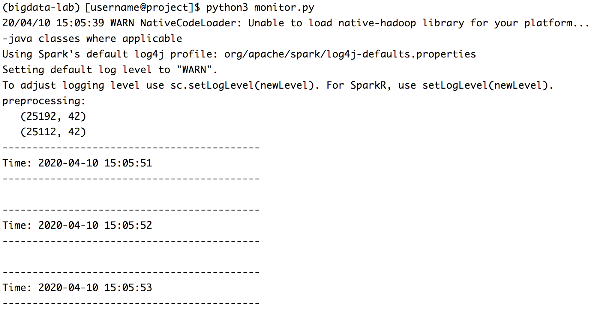

##### 2. Use the command ```python3 stream.py``` on another console 2 to streaming the file “source_dir/Train_clean.csv” and saving partitions under the folder where the monitor is listening.
    * Centroid files will be updating under the folder “mcnn_mcs/”.
    * Predictions will be written to the file “mcnn_pred/mcnn_predictions.csv”.
    * Each partition in the stream will be printed on the console.

This is what the console 1 outputs after running the command.

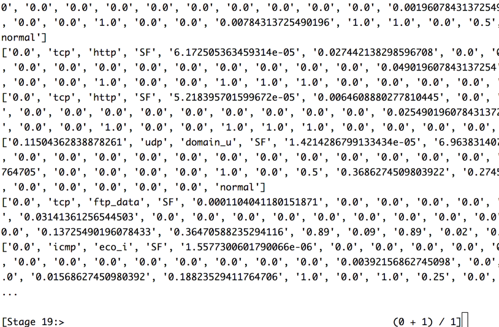

##### 3. Run ```python3 mcnnevl.py``` after “monitor.py” has processed all partitions in the stream. Performances (accuracy, precision, recall, f1-score) and plots (prequential error) will be generated as shown in section III. Results  2. MC-NN.

